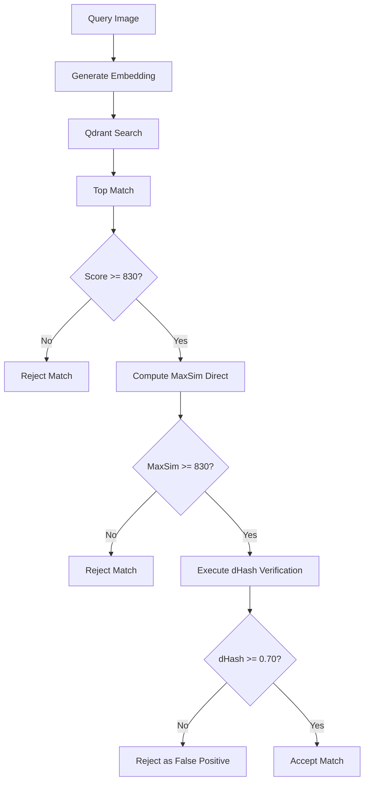
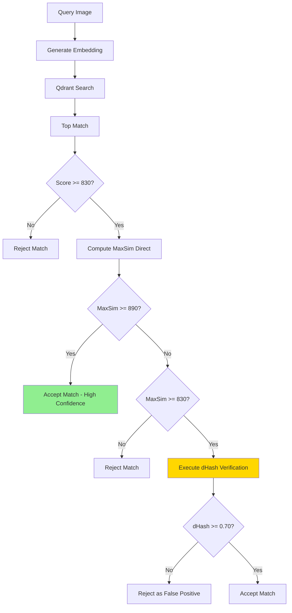

# Design Document: Conditional Hamming Verification

## Overview

Este diseño implementa una optimización del sistema de verificación de imágenes mediante verificación condicional de Hamming (dHash). El sistema actualmente ejecuta verificación visual para todos los matches que superan el umbral de embeddings (830), pero esto es redundante cuando el score de embeddings es muy alto (≥890).

La solución introduce una lógica de tres niveles:
- **Score ≥ 890**: Alta confianza → aceptar sin verificación visual
- **830 ≤ Score < 890**: Confianza media → ejecutar verificación visual (dHash)
- **Score < 830**: Baja confianza → rechazar sin verificación visual

Esta optimización reduce el cómputo innecesario sin sacrificar precisión, ya que scores ≥890 indican coincidencias semánticas muy fuertes que no requieren validación visual adicional.

## Architecture

### Current System Flow



### Optimized System Flow



### Key Changes

1. **Conditional Branch**: Introduce un nuevo punto de decisión después de calcular MaxSim directo
2. **High Confidence Path**: Nuevo camino que omite dHash cuando score ≥ 890
3. **Preserved Logic**: La lógica de verificación visual para scores 830-889 permanece idéntica

## Components and Interfaces

### Modified Component: `_nodo_buscar` Method

**Location**: `muvera_test.py` - Clase del agente RAG

**Current Signature**:
```python
async def _nodo_buscar(self, state: AgentState) -> AgentState
```

**Responsibilities**:
- Generar embeddings de la imagen de consulta
- Ejecutar búsqueda en Qdrant
- Verificar matches usando MaxSim directo
- Ejecutar verificación visual (dHash) cuando sea necesario
- Filtrar resultados basándose en verificaciones

### Modified Logic Block

**Current Code** (líneas ~1260-1280):
```python
if maxsim_directo < UMBRAL_VERIFICACION:
    print(f"      ❌ Tejido NO coincide semánticamente → score bajo")
    has_rejected = True
    resultados = [r for r in resultados if r.get('payload', {}).get('tipo') != 'imagen']
else:
    print(f"      ✅ Tejido coincide semánticamente. Ejecutando Verificación Visual estricta...")
    dhash_sim = self._verificar_match_visual(state['imagen_consulta'], match_path)
    print(f"         Similitud visual (dHash): {dhash_sim:.4f} (umbral: 0.70)")
    
    if dhash_sim < 0.70:
        print(f"         ❌ RECHAZADO: Falso positivo de ColPali. Visualmente son tinturas/imágenes distintas.")
        has_rejected = True
        resultados = [r for r in resultados if r.get('payload', {}).get('tipo') != 'imagen']
    else:
        print(f"         ✅ Match visual confirmado")
```

**New Code Structure**:
```python
HIGH_CONFIDENCE_THRESHOLD = 890.0

if maxsim_directo < UMBRAL_VERIFICACION:
    # Reject: score too low
    print(f"      ❌ Tejido NO coincide semánticamente → score bajo")
    has_rejected = True
    resultados = [r for r in resultados if r.get('payload', {}).get('tipo') != 'imagen']
elif maxsim_directo >= HIGH_CONFIDENCE_THRESHOLD:
    # Accept: high confidence, skip visual verification
    print(f"      ✅ Match confirmado con alta confianza (score >= {HIGH_CONFIDENCE_THRESHOLD}), verificación visual omitida")
else:
    # Medium confidence: execute visual verification
    print(f"      ✅ Tejido coincide semánticamente. Ejecutando Verificación Visual estricta...")
    dhash_sim = self._verificar_match_visual(state['imagen_consulta'], match_path)
    print(f"         Similitud visual (dHash): {dhash_sim:.4f} (umbral: 0.70)")
    
    if dhash_sim < 0.70:
        print(f"         ❌ RECHAZADO: Falso positivo de ColPali. Visualmente son tinturas/imágenes distintas.")
        has_rejected = True
        resultados = [r for r in resultados if r.get('payload', {}).get('tipo') != 'imagen']
    else:
        print(f"         ✅ Match visual confirmado")
```

### Unchanged Components

**`_verificar_match_visual` Method**: No requiere modificaciones. Continúa calculando similitud dHash cuando es invocado.

**`_calcular_dhash` Method**: No requiere modificaciones. Continúa generando hashes perceptuales.

## Data Models

### Constants

```python
# Existing (from environment variable)
UMBRAL_VERIFICACION: float = float(os.getenv("VERIFICATION_THRESHOLD", "830"))

# New (hardcoded constant)
HIGH_CONFIDENCE_THRESHOLD: float = 890.0
```

### State Variables

No se requieren cambios en `AgentState`. Las variables existentes son suficientes:
- `state['imagen_consulta']`: Path de la imagen de consulta
- `state['resultados_busqueda']`: Lista de resultados de búsqueda
- `state['abortar_reset']`: Flag para indicar rechazo de candidatos

### Decision Logic Data

```python
# Input
maxsim_directo: float  # Score de similitud de embeddings (0-1000+)

# Thresholds
UMBRAL_VERIFICACION: float = 830.0  # Minimum semantic match
HIGH_CONFIDENCE_THRESHOLD: float = 890.0  # Skip visual verification

# Output decisions
if maxsim_directo < UMBRAL_VERIFICACION:
    decision = "REJECT"
    execute_dhash = False
elif maxsim_directo >= HIGH_CONFIDENCE_THRESHOLD:
    decision = "ACCEPT"
    execute_dhash = False
else:  # 830 <= maxsim_directo < 890
    decision = "VERIFY"
    execute_dhash = True
```


## Correctness Properties

*A property is a characteristic or behavior that should hold true across all valid executions of a system—essentially, a formal statement about what the system should do. Properties serve as the bridge between human-readable specifications and machine-verifiable correctness guarantees.*

### Property 1: Score-based Decision Logic

*For any* embedding score value, the verification system SHALL make exactly one of three decisions: (1) REJECT without dHash if score < 830, (2) ACCEPT without dHash if score >= 890, or (3) EXECUTE dHash if 830 <= score < 890.

**Validates: Requirements 1.1, 1.2, 1.3**

### Property 2: High Confidence Logging

*For any* embedding score >= 890, the system SHALL log a message indicating that visual verification was skipped due to high confidence, and this log message SHALL contain the score value.

**Validates: Requirements 1.4, 3.1, 3.3**

### Property 3: dHash Verification Behavior

*For any* pair of image paths where dHash verification is executed, the system SHALL: (1) calculate the dHash similarity between the images, (2) REJECT the match if similarity < 0.70, and (3) ACCEPT the match if similarity >= 0.70.

**Validates: Requirements 2.1, 2.2, 2.3**

### Property 4: dHash Similarity Logging

*For any* execution of dHash verification, the system SHALL log the calculated similarity score value in the output.

**Validates: Requirements 2.4, 3.3**

### Property 5: Score Value in Verification Logs

*For any* verification operation (regardless of decision path), the system SHALL include the embedding score value in the log output.

**Validates: Requirements 3.3**

## Error Handling

### Invalid Score Values

**Scenario**: Embedding score calculation returns None or invalid value

**Handling**: 
- Treat as score = 0 (below threshold)
- Reject match without executing dHash
- Log warning about invalid score

```python
if maxsim_directo is None or not isinstance(maxsim_directo, (int, float)):
    print(f"      ⚠️ Score inválido: {maxsim_directo}, tratando como 0")
    maxsim_directo = 0.0
```

### Missing Image Files

**Scenario**: Query or match image path does not exist

**Handling**: Current behavior is preserved - skip verification if files are missing. The existing checks remain:

```python
if (state.get('imagen_consulta')
    and os.path.exists(state['imagen_consulta'])
    and query_mv is not None):
    # Verification logic
```

### dHash Calculation Failure

**Scenario**: `_verificar_match_visual` returns None due to image loading error

**Handling**: Current behavior is preserved - assume match if dHash fails:

```python
# In _verificar_match_visual
if hash1 is None or hash2 is None:
    return 1.0  # Asumir match si falla
```

This is conservative: if we can't verify visually, we trust the embedding score.

### Environment Variable Parsing

**Scenario**: VERIFICATION_THRESHOLD contains invalid value

**Handling**: Add try-except around float conversion:

```python
try:
    UMBRAL_VERIFICACION = float(os.getenv("VERIFICATION_THRESHOLD", "830"))
except (ValueError, TypeError):
    print("⚠️ VERIFICATION_THRESHOLD inválido, usando default 830")
    UMBRAL_VERIFICACION = 830.0
```

## Testing Strategy

### Unit Tests

Unit tests will focus on specific examples and edge cases:

1. **Threshold Boundary Tests**:
   - Score exactly at 830 → should execute dHash
   - Score exactly at 890 → should skip dHash
   - Score at 889.99 → should execute dHash
   - Score at 890.01 → should skip dHash

2. **Configuration Tests**:
   - VERIFICATION_THRESHOLD env var set to custom value
   - VERIFICATION_THRESHOLD env var not set (default 830)
   - VERIFICATION_THRESHOLD env var with invalid value
   - HIGH_CONFIDENCE_THRESHOLD constant value verification

3. **Log Message Format Tests**:
   - High confidence message format: "Match confirmado con alta confianza (score >= 890), verificación visual omitida"
   - Medium confidence message format: "Ejecutando Verificación Visual estricta"
   - dHash result format: "Similitud visual (dHash): X.XXXX (umbral: 0.70)"

4. **Integration with Existing Logic**:
   - Verify `has_rejected` flag is set correctly
   - Verify `resultados` list is filtered correctly
   - Verify state variables are updated correctly

### Property-Based Tests

Property-based tests will verify universal behaviors across many generated inputs using **Hypothesis** (Python PBT library).

**Configuration**: Minimum 100 iterations per property test.

**Test Implementation**:

#### Property 1: Score-based Decision Logic
```python
from hypothesis import given, strategies as st

@given(score=st.floats(min_value=0, max_value=2000, allow_nan=False, allow_infinity=False))
def test_score_based_decision_logic(score):
    """
    Feature: conditional-hamming-verification
    Property 1: For any embedding score value, the verification system SHALL make 
    exactly one of three decisions: (1) REJECT without dHash if score < 830, 
    (2) ACCEPT without dHash if score >= 890, or (3) EXECUTE dHash if 830 <= score < 890.
    """
    # Mock the verification system
    dhash_executed = False
    decision = None
    
    if score < 830:
        decision = "REJECT"
        dhash_executed = False
    elif score >= 890:
        decision = "ACCEPT"
        dhash_executed = False
    else:  # 830 <= score < 890
        decision = "VERIFY"
        dhash_executed = True
    
    # Assertions
    assert decision in ["REJECT", "ACCEPT", "VERIFY"]
    if score < 830:
        assert decision == "REJECT" and not dhash_executed
    elif score >= 890:
        assert decision == "ACCEPT" and not dhash_executed
    else:
        assert decision == "VERIFY" and dhash_executed
```

#### Property 2: High Confidence Logging
```python
@given(score=st.floats(min_value=890, max_value=2000, allow_nan=False, allow_infinity=False))
def test_high_confidence_logging(score, caplog):
    """
    Feature: conditional-hamming-verification
    Property 2: For any embedding score >= 890, the system SHALL log a message 
    indicating that visual verification was skipped due to high confidence, 
    and this log message SHALL contain the score value.
    """
    # Execute verification with mocked components
    # Capture log output
    # Verify log contains skip message and score value
    assert "alta confianza" in log_output.lower()
    assert "890" in log_output
    assert str(score) in log_output or f"{score:.2f}" in log_output
```

#### Property 3: dHash Verification Behavior
```python
@given(
    dhash_similarity=st.floats(min_value=0.0, max_value=1.0, allow_nan=False, allow_infinity=False)
)
def test_dhash_verification_behavior(dhash_similarity):
    """
    Feature: conditional-hamming-verification
    Property 3: For any pair of image paths where dHash verification is executed, 
    the system SHALL: (1) calculate the dHash similarity between the images, 
    (2) REJECT the match if similarity < 0.70, and (3) ACCEPT the match if similarity >= 0.70.
    """
    # Mock _verificar_match_visual to return dhash_similarity
    # Execute verification logic
    # Verify decision matches threshold
    
    if dhash_similarity < 0.70:
        assert match_rejected == True
    else:
        assert match_accepted == True
```

#### Property 4: dHash Similarity Logging
```python
@given(
    score=st.floats(min_value=830, max_value=889.99, allow_nan=False, allow_infinity=False),
    dhash_sim=st.floats(min_value=0.0, max_value=1.0, allow_nan=False, allow_infinity=False)
)
def test_dhash_similarity_logging(score, dhash_sim, caplog):
    """
    Feature: conditional-hamming-verification
    Property 4: For any execution of dHash verification, the system SHALL log 
    the calculated similarity score value in the output.
    """
    # Mock components to trigger dHash execution
    # Capture log output
    # Verify similarity score appears in logs
    
    assert "dhash" in log_output.lower() or "similitud visual" in log_output.lower()
    assert f"{dhash_sim:.4f}" in log_output or f"{dhash_sim:.2f}" in log_output
```

#### Property 5: Score Value in Verification Logs
```python
@given(score=st.floats(min_value=0, max_value=2000, allow_nan=False, allow_infinity=False))
def test_score_in_verification_logs(score, caplog):
    """
    Feature: conditional-hamming-verification
    Property 5: For any verification operation (regardless of decision path), 
    the system SHALL include the embedding score value in the log output.
    """
    # Execute verification with any score
    # Capture log output
    # Verify score appears in logs
    
    assert str(score) in log_output or f"{score:.2f}" in log_output
```

### Test Organization

```
tests/
├── unit/
│   ├── test_threshold_boundaries.py
│   ├── test_configuration.py
│   ├── test_log_formats.py
│   └── test_integration.py
└── property/
    ├── test_decision_logic_property.py
    ├── test_logging_properties.py
    └── test_dhash_properties.py
```

### Testing Approach

1. **Unit tests** verify specific examples, boundary conditions, and configuration handling
2. **Property tests** verify universal behaviors across wide input ranges
3. **Integration tests** verify the complete flow with real image files (manual testing)

### Manual Testing Checklist

- [ ] Test with real histopathology images with score ~895 (should skip dHash)
- [ ] Test with real images with score ~850 (should execute dHash)
- [ ] Test with real images with score ~820 (should reject)
- [ ] Verify log output format matches expectations
- [ ] Verify performance improvement (measure dHash execution count)

