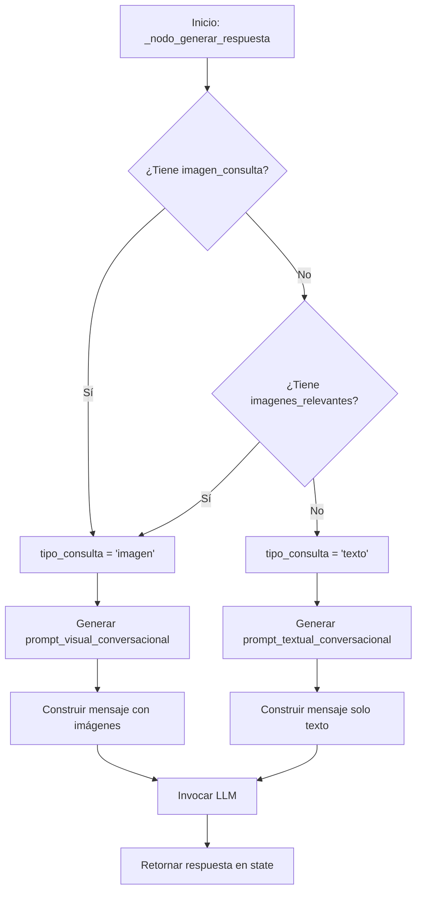

# Design Document: Conversational Text Responses

## Overview

Este diseño extiende el sistema RAG de histopatología para soportar consultas de solo texto con un tono conversacional amigable. El sistema actual está optimizado para análisis de imágenes con un tono técnico formal. Esta mejora permitirá al sistema funcionar como un asistente educativo más versátil que puede responder preguntas conceptuales sin requerir imágenes.

### Objetivos

1. Permitir consultas de solo texto sin degradar la funcionalidad de análisis de imágenes
2. Adaptar dinámicamente el prompt del sistema según el tipo de consulta
3. Implementar un tono conversacional amigable manteniendo rigor científico
4. Estructurar respuestas de forma flexible según el contexto disponible

### Alcance

**En alcance:**
- Detección del tipo de consulta (texto vs. imagen)
- Generación dinámica de prompts adaptados al contexto
- Modificación del tono de respuestas a conversacional
- Estructura de respuesta flexible según disponibilidad de imágenes
- Mensajes de error amigables

**Fuera de alcance:**
- Cambios en la lógica de búsqueda o recuperación de contexto
- Modificaciones a la arquitectura del grafo de agentes
- Cambios en el procesamiento de embeddings
- Nuevas capacidades de análisis visual

## Architecture

### Componentes Afectados

El diseño se centra en modificaciones al método `_nodo_generar_respuesta` de la clase `SistemaRAGColPaliPuro` (líneas 1359-1480 en muvera_test.py).

```
┌─────────────────────────────────────────────────────────────┐
│                    SistemaRAGColPaliPuro                     │
├─────────────────────────────────────────────────────────────┤
│                                                              │
│  _nodo_generar_respuesta(state: AgentState)                 │
│  ┌────────────────────────────────────────────────────┐    │
│  │ 1. Detectar tipo de consulta                       │    │
│  │    - Verificar state['imagen_consulta']            │    │
│  │    - Verificar state['imagenes_relevantes']        │    │
│  └────────────────────────────────────────────────────┘    │
│                          │                                   │
│                          ▼                                   │
│  ┌────────────────────────────────────────────────────┐    │
│  │ 2. Generar prompt adaptado                         │    │
│  │    ┌──────────────┐      ┌──────────────┐         │    │
│  │    │ Consulta con │      │ Consulta de  │         │    │
│  │    │   Imagen     │      │  Solo Texto  │         │    │
│  │    └──────────────┘      └──────────────┘         │    │
│  │          │                       │                 │    │
│  │          ▼                       ▼                 │    │
│  │  Prompt Visual +         Prompt Textual           │    │
│  │  Conversacional          Conversacional           │    │
│  └────────────────────────────────────────────────────┘    │
│                          │                                   │
│                          ▼                                   │
│  ┌────────────────────────────────────────────────────┐    │
│  │ 3. Construir mensaje multimodal                    │    │
│  │    - Agregar contexto textual                      │    │
│  │    - Agregar imágenes (si disponibles)             │    │
│  └────────────────────────────────────────────────────┘    │
│                          │                                   │
│                          ▼                                   │
│  ┌────────────────────────────────────────────────────┐    │
│  │ 4. Invocar LLM y generar respuesta                 │    │
│  └────────────────────────────────────────────────────┘    │
│                                                              │
└─────────────────────────────────────────────────────────────┘
```

### Flujo de Decisión



## Components and Interfaces

### 1. Detector de Tipo de Consulta

**Responsabilidad:** Determinar si la consulta requiere análisis visual o es puramente textual.

**Interfaz:**
```python
def _detectar_tipo_consulta(self, state: AgentState) -> str:
    """
    Detecta el tipo de consulta basándose en el estado.
    
    Args:
        state: Estado actual del agente
        
    Returns:
        'imagen' si hay contexto visual disponible, 'texto' en caso contrario
    """
    pass
```

**Lógica:**
- Si `state['imagen_consulta']` existe y es un path válido → 'imagen'
- Si `state['imagenes_relevantes']` no está vacío → 'imagen'
- En cualquier otro caso → 'texto'

### 2. Generador de Prompts Adaptativos

**Responsabilidad:** Crear el prompt del sistema apropiado según el tipo de consulta.

**Interfaz:**
```python
def _generar_prompt_sistema(self, tipo_consulta: str) -> str:
    """
    Genera el prompt del sistema adaptado al tipo de consulta.
    
    Args:
        tipo_consulta: 'imagen' o 'texto'
        
    Returns:
        String con el prompt del sistema
    """
    pass
```

**Prompts:**

**Prompt para consultas de texto:**
```
Eres un profesor experto en histopatología con un estilo amigable y educativo. 
Tu función es ayudar a estudiantes a comprender conceptos de histopatología 
respondiendo sus preguntas de forma clara y accesible.

REGLAS DE PRECISIÓN:
1. Responde basándote en el contexto textual proporcionado.
2. Puedes realizar deducciones lógicas apoyadas en el texto del contexto, 
   citando qué parte te permite deducirlo.
3. Si el contexto es insuficiente, responde honestamente: 
   "No tengo suficiente información en mis fuentes para responder eso con 
   precisión. ¿Podrías reformular tu pregunta o darme más detalles?"
4. Nunca inventes información que no esté en el contexto.
5. Usa un tono conversacional pero mantén el rigor científico.

ESTRUCTURA DE RESPUESTA:
1. **Respuesta directa**: Responde la pregunta de forma clara y concisa.
2. **Explicación**: Desarrolla los conceptos relevantes.
3. **Evidencia**: Cita las fuentes del contexto que respaldan tu respuesta.
4. **Contexto adicional** (opcional): Información relacionada que pueda ser útil.
```

**Prompt para consultas con imagen:**
```
Eres un profesor experto en histopatología con un estilo amigable y educativo. 
Tu función es ayudar a estudiantes a comprender conceptos de histopatología 
analizando imágenes y respondiendo sus preguntas de forma clara y accesible.

REGLA FUNDAMENTAL SOBRE IMÁGENES RECUPERADAS:
Las imágenes etiquetadas como [IMAGEN RECUPERADA] son el RESULTADO de una 
búsqueda por similitud en la base de datos. Estas imágenes YA PASARON un 
umbral de similitud alto y SON la mejor coincidencia encontrada. Por lo tanto:
- DEBES describir y analizar las imágenes recuperadas usando el texto asociado.
- Si el usuario subió una imagen (etiquetada como [IMAGEN DE CONSULTA DEL USUARIO]), 
  la imagen recuperada ES la coincidencia encontrada para esa consulta.
- NO rechaces una imagen recuperada diciendo que "no coincide" con la del usuario.
- Si una página contiene múltiples figuras, analiza visualmente la imagen 
  recuperada y compárala con las DESCRIPCIONES de cada figura en el texto 
  asociado para determinar cuál es.

REGLAS DE PRECISIÓN:
1. Responde basándote en el contexto proporcionado (imágenes recuperadas y 
   fragmentos de texto).
2. Puedes realizar deducciones lógicas apoyadas en el texto o imágenes del 
   contexto, citando qué parte te permite deducirlo.
3. Si el contexto es insuficiente, responde honestamente: 
   "No tengo suficiente información en mis fuentes para responder eso con 
   precisión. ¿Podrías reformular tu pregunta o darme más detalles?"
4. Nunca inventes información que no esté en el contexto.
5. Usa un tono conversacional pero mantén el rigor científico.

REGLAS SOBRE FIGURAS:
1. Si el usuario pregunta por una figura específica (ej: "Figura 14.3"), 
   SOLO describe esa figura usando el texto asociado.
2. Si la imagen recuperada contiene múltiples figuras, identifica y describe 
   SOLO la que el usuario solicitó.

ESTRUCTURA DE RESPUESTA:
1. **Imagen encontrada**: Indica qué imagen se recuperó y su figura correspondiente.
2. **Análisis Visual**: Describe qué se observa en la imagen según el texto asociado.
3. **Identificación**: Qué órgano/tejido/estructura se observa.
4. **Evidencia**: Integra lo que se ve en la imagen con lo que dice el texto.
```

### 3. Constructor de Mensajes

**Responsabilidad:** Ensamblar el mensaje completo para el LLM incluyendo contexto e imágenes.

**Interfaz:**
```python
def _construir_mensaje_usuario(
    self, 
    state: AgentState, 
    tipo_consulta: str
) -> List[Dict[str, Any]]:
    """
    Construye el contenido del mensaje de usuario.
    
    Args:
        state: Estado actual del agente
        tipo_consulta: 'imagen' o 'texto'
        
    Returns:
        Lista de partes del mensaje (texto e imágenes)
    """
    pass
```

**Estructura del mensaje:**

Para consultas de texto:
```python
[
    {
        "type": "text",
        "text": f"""
        {historial_conversacion}
        
        CONSULTA: {consulta_usuario}
        
        CONTEXTO RECUPERADO:
        {contexto_documentos}
        
        Responde basándote en el contexto de arriba.
        """
    }
]
```

Para consultas con imagen:
```python
[
    {
        "type": "text",
        "text": f"""
        {historial_conversacion}
        
        CONSULTA: {consulta_usuario}
        
        NOTA: Se encontraron {n} imágenes coincidentes en la base de datos.
        
        CONTEXTO RECUPERADO:
        {contexto_documentos}
        
        Responde basándote en el contexto y las imágenes adjuntas.
        """
    },
    {"type": "text", "text": "[IMAGEN RECUPERADA 1: nombre.jpg]"},
    {"type": "image_url", "image_url": {"url": "data:image/jpeg;base64,..."}},
    # ... más imágenes
]
```

## Data Models

### AgentState (sin cambios)

El estado existente ya contiene todos los campos necesarios:

```python
class AgentState(TypedDict):
    consulta_usuario: str              # Texto de la consulta
    imagen_consulta: Optional[str]     # Path a imagen del usuario (si existe)
    imagenes_relevantes: List[str]     # Paths a imágenes recuperadas
    contexto_documentos: str           # Contexto textual recuperado
    contexto_memoria: str              # Historial de conversación
    respuesta_final: str               # Respuesta generada
    # ... otros campos
```

### Nuevos Tipos (Enums)

```python
from enum import Enum

class TipoConsulta(Enum):
    """Tipo de consulta del usuario"""
    TEXTO = "texto"
    IMAGEN = "imagen"
```

## Error Handling

### Casos de Error

1. **Contexto insuficiente o vacío**
   - **Detección:** `len(state['contexto_documentos'].strip()) < 50`
   - **Respuesta:** Mensaje amigable sugiriendo reformular
   - **Mensaje:** "No tengo suficiente información en mis fuentes para responder eso con precisión. ¿Podrías reformular tu pregunta o darme más detalles sobre qué aspecto específico te interesa?"

2. **Error al cargar imágenes**
   - **Detección:** Excepción al leer archivo de imagen
   - **Manejo:** Log del error, continuar sin esa imagen
   - **Comportamiento:** Si todas las imágenes fallan, tratar como consulta de texto

3. **Límite de imágenes excedido**
   - **Detección:** `len(imagenes_relevantes) > max_imagenes`
   - **Manejo:** Truncar lista y log de advertencia
   - **Mensaje al usuario:** No visible (manejo interno)

4. **Error en invocación del LLM**
   - **Detección:** Excepción en `llm.ainvoke()`
   - **Manejo:** Propagar excepción (manejada por capas superiores)
   - **Logging:** Error completo con stack trace

### Estrategia de Logging

```python
# Nivel INFO
print(f"   📝 Tipo de consulta detectado: {tipo_consulta}")
print(f"   🖼️ Adjuntando {n} imágenes al prompt")
print("   ✅ Respuesta generada")

# Nivel WARNING
print(f"   ⚠️ Limitando a {max} imágenes (de {total}) por restricción de API")
print(f"   ⚠️ Error cargando imagen {path}: {error}")

# Nivel ERROR (excepciones)
# Manejadas por el sistema de logging existente
```

## Testing Strategy

### Enfoque de Testing

Esta funcionalidad NO es adecuada para property-based testing porque:
- Involucra comportamiento de UI/UX (tono conversacional, estructura de respuesta)
- Depende de servicios externos (LLM API)
- Los resultados son no determinísticos (respuestas generadas por LLM)
- La "corrección" es subjetiva (calidad del tono, claridad de la respuesta)

Por lo tanto, usaremos:
1. **Unit tests** para lógica de detección y construcción de prompts
2. **Integration tests** con mocks del LLM para verificar flujos completos
3. **Manual testing** para evaluar calidad de respuestas

### Unit Tests

**Test Suite 1: Detección de Tipo de Consulta**

```python
def test_detectar_tipo_consulta_con_imagen_usuario():
    """Debe detectar 'imagen' cuando hay imagen_consulta"""
    state = {
        'imagen_consulta': '/path/to/image.jpg',
        'imagenes_relevantes': []
    }
    assert sistema._detectar_tipo_consulta(state) == 'imagen'

def test_detectar_tipo_consulta_con_imagenes_recuperadas():
    """Debe detectar 'imagen' cuando hay imagenes_relevantes"""
    state = {
        'imagen_consulta': None,
        'imagenes_relevantes': ['/path/to/retrieved.jpg']
    }
    assert sistema._detectar_tipo_consulta(state) == 'imagen'

def test_detectar_tipo_consulta_solo_texto():
    """Debe detectar 'texto' cuando no hay imágenes"""
    state = {
        'imagen_consulta': None,
        'imagenes_relevantes': []
    }
    assert sistema._detectar_tipo_consulta(state) == 'texto'

def test_detectar_tipo_consulta_imagen_invalida():
    """Debe detectar 'texto' si imagen_consulta no existe"""
    state = {
        'imagen_consulta': '/path/nonexistent.jpg',
        'imagenes_relevantes': []
    }
    assert sistema._detectar_tipo_consulta(state) == 'texto'
```

**Test Suite 2: Generación de Prompts**

```python
def test_generar_prompt_texto_contiene_elementos_clave():
    """Prompt de texto debe contener elementos conversacionales"""
    prompt = sistema._generar_prompt_sistema('texto')
    assert 'profesor experto' in prompt.lower()
    assert 'amigable' in prompt.lower()
    assert 'contexto textual' in prompt.lower()
    assert 'imagen' not in prompt.lower()  # No debe mencionar imágenes

def test_generar_prompt_imagen_contiene_elementos_clave():
    """Prompt de imagen debe contener instrucciones visuales"""
    prompt = sistema._generar_prompt_sistema('imagen')
    assert 'profesor experto' in prompt.lower()
    assert 'amigable' in prompt.lower()
    assert 'imagen recuperada' in prompt.lower()
    assert 'análisis visual' in prompt.lower()

def test_prompts_mantienen_rigor_cientifico():
    """Ambos prompts deben mencionar precisión y evidencia"""
    for tipo in ['texto', 'imagen']:
        prompt = sistema._generar_prompt_sistema(tipo)
        assert 'precisión' in prompt.lower() or 'precis' in prompt.lower()
        assert 'evidencia' in prompt.lower() or 'contexto' in prompt.lower()
```

**Test Suite 3: Construcción de Mensajes**

```python
def test_construir_mensaje_texto_solo_contiene_texto():
    """Mensaje de texto no debe incluir partes de imagen"""
    state = crear_state_texto()
    mensaje = sistema._construir_mensaje_usuario(state, 'texto')
    
    tipos = [parte['type'] for parte in mensaje]
    assert 'text' in tipos
    assert 'image_url' not in tipos

def test_construir_mensaje_imagen_incluye_imagenes():
    """Mensaje de imagen debe incluir partes de imagen"""
    state = crear_state_con_imagenes()
    mensaje = sistema._construir_mensaje_usuario(state, 'imagen')
    
    tipos = [parte['type'] for parte in mensaje]
    assert 'text' in tipos
    assert 'image_url' in tipos

def test_construir_mensaje_respeta_limite_imagenes():
    """No debe incluir más de max_imagenes"""
    state = crear_state_con_muchas_imagenes(10)
    mensaje = sistema._construir_mensaje_usuario(state, 'imagen')
    
    imagenes = [p for p in mensaje if p['type'] == 'image_url']
    assert len(imagenes) <= 5  # Límite de API

def test_construir_mensaje_incluye_contexto():
    """Mensaje debe incluir contexto_documentos"""
    state = crear_state_texto()
    state['contexto_documentos'] = "Contexto de prueba"
    mensaje = sistema._construir_mensaje_usuario(state, 'texto')
    
    texto_completo = ' '.join([p['text'] for p in mensaje if p['type'] == 'text'])
    assert "Contexto de prueba" in texto_completo
```

### Integration Tests (con Mocks)

```python
@pytest.mark.asyncio
async def test_flujo_completo_consulta_texto():
    """Test end-to-end para consulta de solo texto"""
    # Arrange
    sistema = SistemaRAGColPaliPuro()
    sistema.llm = MockLLM(response="Respuesta de prueba")
    
    state = {
        'consulta_usuario': '¿Qué es el epitelio?',
        'imagen_consulta': None,
        'imagenes_relevantes': [],
        'contexto_documentos': 'El epitelio es un tejido...',
        'contexto_memoria': '',
        'trayectoria': []
    }
    
    # Act
    resultado = await sistema._nodo_generar_respuesta(state)
    
    # Assert
    assert resultado['respuesta_final'] == "Respuesta de prueba"
    assert sistema.llm.last_prompt_type == 'texto'
    assert len(sistema.llm.last_message_images) == 0

@pytest.mark.asyncio
async def test_flujo_completo_consulta_imagen():
    """Test end-to-end para consulta con imagen"""
    # Arrange
    sistema = SistemaRAGColPaliPuro()
    sistema.llm = MockLLM(response="Análisis de imagen")
    
    state = crear_state_con_imagen_real()
    
    # Act
    resultado = await sistema._nodo_generar_respuesta(state)
    
    # Assert
    assert resultado['respuesta_final'] == "Análisis de imagen"
    assert sistema.llm.last_prompt_type == 'imagen'
    assert len(sistema.llm.last_message_images) > 0

@pytest.mark.asyncio
async def test_manejo_contexto_vacio():
    """Sistema debe manejar gracefully contexto vacío"""
    sistema = SistemaRAGColPaliPuro()
    sistema.llm = MockLLM(response="No tengo información suficiente")
    
    state = crear_state_sin_contexto()
    
    # Act
    resultado = await sistema._nodo_generar_respuesta(state)
    
    # Assert
    assert 'respuesta_final' in resultado
    # El LLM debería recibir el prompt con contexto vacío
    # y responder apropiadamente
```

### Manual Testing Checklist

Casos a verificar manualmente:

1. **Tono conversacional**
   - [ ] Respuestas usan lenguaje amigable y accesible
   - [ ] Se mantiene rigor científico
   - [ ] No hay jerga excesivamente técnica sin explicación

2. **Consultas de texto**
   - [ ] Responde preguntas conceptuales sin imágenes
   - [ ] Estructura de respuesta es clara y organizada
   - [ ] Cita correctamente el contexto textual

3. **Consultas con imagen**
   - [ ] Analiza correctamente imágenes recuperadas
   - [ ] Integra análisis visual con contexto textual
   - [ ] Identifica figuras específicas cuando se solicita

4. **Manejo de errores**
   - [ ] Mensajes de error son amigables y útiles
   - [ ] Sugiere reformular cuando no hay contexto
   - [ ] No inventa información

5. **Casos edge**
   - [ ] Consulta ambigua (¿texto o imagen?)
   - [ ] Múltiples figuras en una imagen
   - [ ] Contexto muy limitado
   - [ ] Pregunta fuera del dominio

## Implementation Notes

### Orden de Implementación

1. **Fase 1: Refactorización preparatoria**
   - Extraer lógica de detección de tipo de consulta
   - Extraer generación de prompts a métodos separados
   - Extraer construcción de mensajes a método separado

2. **Fase 2: Implementación de prompts conversacionales**
   - Crear prompt para consultas de texto
   - Crear prompt para consultas con imagen
   - Implementar selector de prompt

3. **Fase 3: Adaptación de construcción de mensajes**
   - Modificar construcción para consultas de texto
   - Mantener construcción para consultas con imagen
   - Implementar manejo de casos edge

4. **Fase 4: Testing y refinamiento**
   - Implementar unit tests
   - Implementar integration tests
   - Realizar manual testing
   - Ajustar prompts según resultados

### Consideraciones de Compatibilidad

- **Backward compatibility:** El cambio es completamente compatible hacia atrás. Las consultas con imagen seguirán funcionando exactamente igual.
- **State management:** No se requieren cambios al `AgentState`.
- **API externa:** No hay cambios en la interfaz pública del sistema.

### Performance

- **Impacto mínimo:** La detección de tipo de consulta es O(1).
- **Reducción de carga:** Consultas de texto no cargarán imágenes innecesariamente, reduciendo el tamaño del payload al LLM.
- **Latencia:** Potencial mejora en latencia para consultas de texto (menos datos a transferir).

### Configuración

Parámetros configurables (pueden agregarse a `Config` si es necesario):

```python
class Config:
    # Límites de imágenes
    MAX_IMAGENES_CON_QUERY = 4
    MAX_IMAGENES_SIN_QUERY = 5
    
    # Umbrales de contexto
    MIN_CONTEXTO_LENGTH = 50  # Caracteres mínimos para considerar contexto válido
    
    # Mensajes
    MENSAJE_SIN_CONTEXTO = (
        "No tengo suficiente información en mis fuentes para responder eso "
        "con precisión. ¿Podrías reformular tu pregunta o darme más detalles "
        "sobre qué aspecto específico te interesa?"
    )
```

## Dependencies

### Dependencias Existentes (sin cambios)

- `langchain_core.messages`: `SystemMessage`, `HumanMessage`
- `base64`: Para codificación de imágenes
- `os`: Para verificación de paths
- `typing`: Para type hints

### Nuevas Dependencias (ninguna)

No se requieren nuevas dependencias externas.

## Migration Strategy

### Plan de Migración

1. **Despliegue sin downtime:** Los cambios son internos al método `_nodo_generar_respuesta`. No hay cambios de API.

2. **Testing en producción:**
   - Desplegar con feature flag (opcional)
   - Monitorear logs para errores
   - Comparar calidad de respuestas

3. **Rollback plan:**
   - Revertir commit si hay problemas
   - El código anterior está completamente funcional

### Validación Post-Despliegue

Métricas a monitorear:

1. **Funcionales:**
   - Tasa de error en `_nodo_generar_respuesta`
   - Distribución de tipos de consulta (texto vs. imagen)
   - Tiempo de respuesta promedio

2. **Calidad:**
   - Feedback de usuarios (si disponible)
   - Revisión manual de muestra de respuestas
   - Verificación de tono conversacional

3. **Performance:**
   - Latencia P50, P95, P99
   - Tamaño de payload al LLM
   - Uso de memoria

## Future Enhancements

Posibles mejoras futuras (fuera del alcance actual):

1. **Detección automática de intención:** Usar un clasificador para determinar si el usuario espera análisis visual incluso sin imagen.

2. **Prompts personalizables:** Permitir configurar el tono (formal, casual, técnico) según preferencias del usuario.

3. **Respuestas estructuradas:** Generar respuestas en formato JSON estructurado para mejor presentación en UI.

4. **A/B testing de prompts:** Framework para probar diferentes variaciones de prompts y medir efectividad.

5. **Feedback loop:** Capturar feedback de usuarios para mejorar prompts iterativamente.

6. **Multilenguaje:** Adaptar prompts y respuestas a diferentes idiomas.
