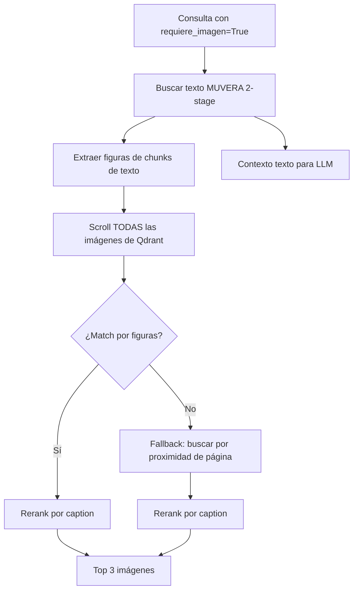
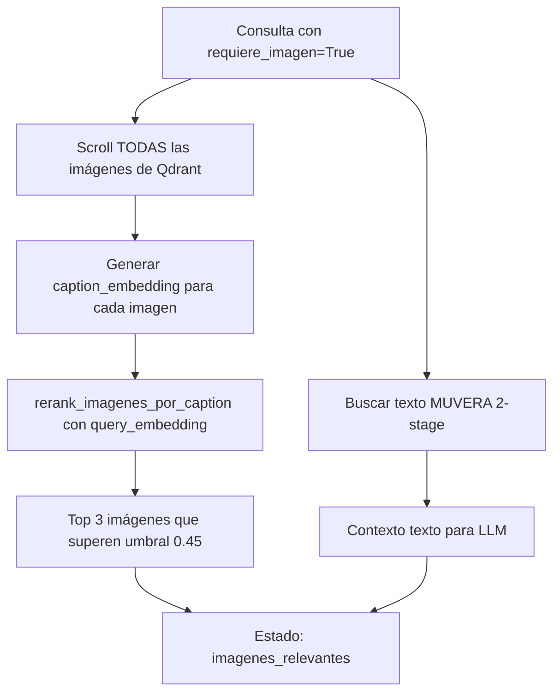

# Documento de Diseño — Búsqueda Semántica de Imágenes

## Resumen

Este diseño describe la simplificación del Path 2 (`requiere_imagen=True`, sin imagen adjunta) en el método `_nodo_buscar` de `SistemaRAGColPaliPuro`. El enfoque actual depende de referencias indirectas de figuras extraídas de chunks de texto para localizar imágenes relevantes, con un fallback por proximidad de página. El nuevo enfoque reemplaza toda esa lógica por una comparación semántica directa: se generan embeddings de los captions de **todas** las imágenes en Qdrant y se usa `rerank_imagenes_por_caption()` para ordenarlas por similitud coseno con la consulta del usuario, devolviendo las top 3 que superen el umbral.

La búsqueda de texto para contexto del LLM se mantiene intacta como un flujo paralelo e independiente.

### Hallazgos Clave de la Investigación

- La función `rerank_imagenes_por_caption()` ya implementa: cálculo de similitud coseno entre embedding medio de la consulta y embedding medio del caption, filtro por umbral absoluto (0.45) y filtro relativo (75% del score máximo).
- `ProcesadorColPaliPuro.generar_embedding_texto()` genera multi-vector embeddings (2D numpy array) para cualquier texto, incluyendo captions de imágenes.
- Las imágenes en Qdrant tienen el campo `texto` en su payload que contiene el caption/descripción, y se filtran por `tipo="imagen"`.
- El scroll de Qdrant con filtro `tipo="imagen"` ya se usa en el Path 2 actual, por lo que el patrón es conocido y probado.
- El proyecto usa `hypothesis` y `pytest` como frameworks de testing (definidos en `pyproject.toml` bajo `[dependency-groups] dev`).

## Arquitectura

### Flujo Actual (Path 2) — A Eliminar



### Flujo Nuevo (Path 2) — Propuesto



### Decisión de Diseño: Flujos Paralelos Independientes

La búsqueda de texto y la búsqueda de imágenes son operaciones independientes que no comparten resultados intermedios. Esto simplifica el código y elimina la dependencia frágil de que los chunks de texto mencionen figuras específicas.

**Justificación**: El enfoque actual falla cuando una imagen tiene un caption semánticamente relevante a la consulta pero no está referenciada en ningún chunk de texto recuperado. La comparación directa contra captions elimina este punto de fallo.

## Componentes e Interfaces

### Componentes Modificados

#### 1. `SistemaRAGColPaliPuro._nodo_buscar` (Path 2)

**Cambio**: Reemplazar toda la lógica de Path 2 (extracción de figuras, match por figuras, fallback por página) con búsqueda semántica directa por caption.

**Interfaz preservada**: La firma del método y la estructura del `AgentState` de salida no cambian. El método sigue recibiendo un `AgentState` y devolviendo un `AgentState` con los campos `resultados_busqueda`, `imagenes_relevantes`, `contexto_documentos` y `abortar_reset` actualizados.

**Lógica nueva del Path 2**:

```python
# Paso 1: Buscar texto (sin cambios)
resultados_texto, has_rejected = await self.gestor_qdrant.buscar_muvera_2stage(
    query_mv, query_fde, min_score=0.0, filtro_tipo="texto"
)

# Paso 2: Scroll de todas las imágenes
all_image_points = await client.scroll(
    collection_name=self.gestor_qdrant.content_mv_collection,
    scroll_filter=Filter(must=[FieldCondition(key="tipo", match=MatchValue(value="imagen"))]),
    limit=1000, with_payload=True, with_vectors=False,
)

# Paso 3: Generar caption embeddings y construir candidatas
candidatas = []
for punto in all_image_points[0]:
    payload = punto.payload or {}
    caption = payload.get('texto', '') or payload.get('contexto_texto', '')
    if caption:
        emb = self.procesador.generar_embedding_texto(caption)
        if emb is not None:
            candidatas.append({
                "id": punto.id,
                "payload": payload,
                "caption_embedding": emb,
            })

# Paso 4: Rerank por similitud semántica
imagenes_reranked = rerank_imagenes_por_caption(query_mv, candidatas, umbral=0.45)

# Paso 5: Seleccionar top 3
imagenes_encontradas = []
for r in imagenes_reranked[:3]:
    img_path = r.get("payload", {}).get("imagen_path", "")
    caption = r.get("payload", {}).get("texto", "") or r.get("payload", {}).get("contexto_texto", "")
    if img_path and os.path.exists(img_path):
        imagenes_encontradas.append({
            "path": img_path,
            "descripcion": caption[:300]
        })
```

### Componentes Sin Cambios

| Componente | Razón |
|---|---|
| `rerank_imagenes_por_caption()` | Se reutiliza tal cual. Ya implementa filtro absoluto + relativo + ordenamiento. |
| `ProcesadorColPaliPuro.generar_embedding_texto()` | Se usa para generar embeddings de captions. Sin modificaciones. |
| `GestorQdrantMuvera` | El scroll con filtro por tipo ya es un patrón usado. Sin modificaciones. |
| `filtrar_resultados_busqueda()` | No se usa en el nuevo Path 2 (las imágenes se manejan directamente). |
| Path 1 (solo texto) y Path 3 (imagen adjunta) | No se modifican. |
| Frontend (`Chat.tsx`) | No requiere cambios — ya renderiza `imagenes_relevantes` como lista de `{path, descripcion}`. |
| API (`api.py`) | No requiere cambios — ya pasa `imagenes_relevantes` al frontend. |

### Código a Eliminar del Path 2

1. Extracción de figuras de chunks de texto (`figuras_referenciadas`, `paginas_relevantes`)
2. Match de imágenes por campo `figuras` (Intento A+B)
3. Fallback por proximidad de página (Fallback C)
4. Toda la lógica condicional entre los tres intentos

## Modelos de Datos

### Estructura de Candidata para Rerank (sin cambios)

```python
candidata = {
    "id": str,                    # ID del punto en Qdrant
    "payload": {
        "pdf_name": str,
        "tipo": "imagen",
        "texto": str,             # Caption/descripción de la imagen
        "imagen_path": str,       # Ruta al archivo de imagen
        "contexto_texto": str,    # Texto circundante
        "numero_pagina": int,
        "figuras": List[str],     # Ej: ["11.5"]
        "nombre_archivo": str,
    },
    "caption_embedding": np.ndarray,  # Multi-vector embedding del caption (2D)
}
```

### Estructura de Imagen Relevante en Estado (sin cambios)

```python
imagen_relevante = {
    "path": str,          # Ruta al archivo de imagen
    "descripcion": str,   # Caption truncado a 300 caracteres
}
```

### AgentState — Campos Relevantes (sin cambios)

| Campo | Tipo | Descripción |
|---|---|---|
| `requiere_imagen` | `bool` | Si la consulta requiere imágenes |
| `imagen_consulta` | `Optional[str]` | Ruta de imagen adjunta (None en Path 2) |
| `imagenes_relevantes` | `List[Any]` | Lista de imágenes encontradas |
| `resultados_busqueda` | `List[Dict]` | Resultados de texto para contexto LLM |
| `contexto_documentos` | `str` | Texto formateado para el prompt del LLM |

## Propiedades de Correctitud

*Una propiedad es una característica o comportamiento que debe mantenerse verdadero en todas las ejecuciones válidas de un sistema — esencialmente, una declaración formal sobre lo que el sistema debe hacer. Las propiedades sirven como puente entre especificaciones legibles por humanos y garantías de correctitud verificables por máquina.*

### Propiedad 1: Construcción de candidatas preserva imágenes con caption

*Para cualquier* lista de puntos de imagen de Qdrant, la lista de candidatas construida debe contener exactamente aquellos puntos que tienen un caption no vacío (campo `texto` o `contexto_texto` en el payload), y cada candidata debe incluir un `caption_embedding` válido (array numpy 2D no nulo).

**Valida: Requisitos 1.2**

### Propiedad 2: Invariante de selección top-3 con umbral

*Para cualquier* lista de candidatas rerankeadas con scores de similitud, la selección final debe cumplir: (a) contener como máximo 3 imágenes, (b) todas las imágenes seleccionadas tienen score ≥ umbral, (c) si hay más de 3 candidatas que superan el umbral, las 3 seleccionadas son las de mayor score, y (d) si hay menos de 3 que superan el umbral, se incluyen solo las que lo superan sin rellenar.

**Valida: Requisitos 1.4, 3.1, 3.2, 3.3**

### Propiedad 3: Formato de salida de imágenes relevantes

*Para cualquier* imagen seleccionada como relevante, el diccionario de salida debe contener exactamente las claves `path` (string no vacío que corresponde a una ruta de archivo) y `descripcion` (string con longitud ≤ 300 caracteres).

**Valida: Requisitos 1.5**

### Propiedad 4: Rerank respeta umbral absoluto y relativo

*Para cualquier* conjunto de candidatas con `caption_embedding` y cualquier embedding de consulta, todas las candidatas retornadas por `rerank_imagenes_por_caption` deben tener similitud coseno ≥ umbral absoluto (0.45) Y similitud coseno ≥ 75% del score máximo entre todas las candidatas.

**Valida: Requisitos 5.2**

### Propiedad 5: Rerank omite candidatas sin embedding

*Para cualquier* lista mixta de candidatas donde algunas tienen `caption_embedding` y otras no, `rerank_imagenes_por_caption` debe retornar solo candidatas que originalmente tenían `caption_embedding`, sin generar errores ni incluir candidatas sin embedding.

**Valida: Requisitos 5.3**

## Manejo de Errores

### Errores en Scroll de Qdrant

Si el scroll de imágenes de Qdrant falla (timeout, conexión perdida), el Path 2 debe:
1. Imprimir un warning con el error (`⚠️ Error obteniendo imágenes de Qdrant: {e}`)
2. Continuar con `imagenes_relevantes = []` (sin imágenes, pero la respuesta textual sigue funcionando)
3. No propagar la excepción — el flujo del grafo LangGraph no debe interrumpirse

Este comportamiento ya existe en el código actual y se preserva.

### Errores en Generación de Embeddings

Si `generar_embedding_texto(caption)` retorna `None` para un caption específico:
1. Esa imagen se omite de la lista de candidatas (no se incluye en el rerank)
2. Se continúa procesando las demás imágenes
3. No se genera error — es un caso esperado (captions vacíos o malformados)

### Errores en Verificación de Archivos

Si `os.path.exists(img_path)` retorna `False` para una imagen seleccionada:
1. Esa imagen se omite de `imagenes_relevantes`
2. Se continúa con las demás imágenes seleccionadas
3. Esto puede resultar en menos de 3 imágenes en el resultado final (comportamiento correcto según Requisito 3.3)

### Caso Sin Resultados

Si ninguna imagen supera el umbral de similitud:
1. `imagenes_relevantes` se establece como lista vacía `[]`
2. La respuesta del LLM se genera normalmente usando solo el contexto textual
3. El frontend no muestra sección de imágenes (comportamiento existente)

## Estrategia de Testing

### Enfoque Dual: Tests Unitarios + Tests de Propiedades

Este feature es adecuado para property-based testing porque la lógica central (construcción de candidatas, selección top-3, reranking por similitud) son funciones puras o cuasi-puras con comportamiento que varía significativamente con los inputs.

**Librería PBT**: `hypothesis` (ya instalada en el proyecto como dependencia de desarrollo)

### Tests de Propiedades (Property-Based Tests)

Cada propiedad del documento de diseño se implementa como un test de propiedades con mínimo 100 iteraciones:

| Propiedad | Test | Generadores |
|---|---|---|
| P1: Construcción de candidatas | Generar listas de puntos con payloads aleatorios (con/sin caption) | Listas de dicts con campos `texto` y `contexto_texto` aleatorios |
| P2: Invariante top-3 | Generar listas de candidatas rerankeadas con scores aleatorios | Listas de floats entre 0.0 y 1.0, longitudes variables |
| P3: Formato de salida | Generar payloads de imagen con captions de longitud variable | Strings aleatorios, rutas de archivo |
| P4: Rerank umbral absoluto+relativo | Generar embeddings aleatorios (query + candidatas) | Arrays numpy 2D con valores aleatorios normalizados |
| P5: Rerank sin embedding | Generar listas mixtas de candidatas | Dicts con/sin clave `caption_embedding` |

**Configuración**: Cada test usa `@settings(max_examples=100)` y se etiqueta con:
```
# Feature: semantic-image-search, Property {N}: {descripción}
```

### Tests Unitarios (Example-Based)

| Criterio | Test | Tipo |
|---|---|---|
| 1.6 | Ninguna imagen supera umbral → lista vacía | Edge case |
| 2.1-2.3 | Path 2 no ejecuta extracción de figuras ni fallback por página | Example (mock) |
| 2.4 | Búsqueda de texto se ejecuta independientemente | Integration |
| 4.1-4.2 | Texto fluye a contexto_documentos | Integration |
| 4.3 | Independencia entre búsqueda de texto e imágenes | Example |

### Tests de Integración

| Escenario | Descripción |
|---|---|
| Path 2 end-to-end | Consulta con `requiere_imagen=True`, verificar que se obtienen imágenes por caption y texto para contexto |
| Sin imágenes en Qdrant | Scroll retorna lista vacía, verificar que `imagenes_relevantes = []` y texto funciona |
| Error de Qdrant | Simular fallo de conexión, verificar degradación graceful |

