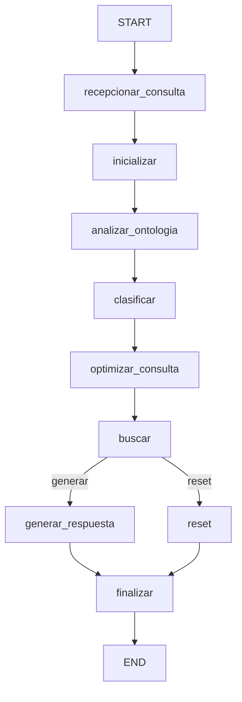
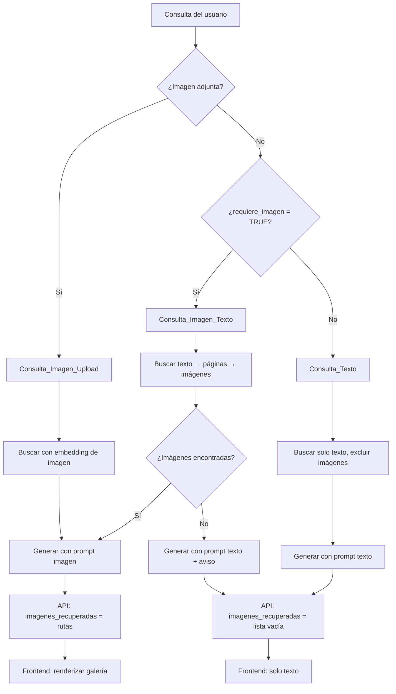

# Diseño: Respuestas Inteligentes de Texto e Imagen

## Resumen

Este diseño detalla las modificaciones necesarias al sistema RAG multimodal de histopatología para garantizar que las respuestas sean **solo texto por defecto** y que las imágenes se entreguen **únicamente cuando el usuario las solicita explícitamente**. El sistema ya tiene lógica parcial implementada en `muvera_test.py`, `api.py` y `Chat.tsx`; el objetivo principal es corregir inconsistencias en el flujo existente para que la clasificación, búsqueda, generación y entrega de imágenes sean coherentes de extremo a extremo.

### Decisiones de Diseño Clave

1. **Refactorizar, no reescribir**: Se modifican los nodos existentes del grafo LangGraph (`_nodo_clasificar`, `_nodo_buscar`, `_nodo_generar_respuesta`) en lugar de crear nuevos componentes.
2. **Clasificación como fuente de verdad**: El campo `requiere_imagen` del `AgentState` es el único punto de decisión para incluir o excluir imágenes en todo el flujo.
3. **Filtrado estricto en el Buscador**: Las imágenes se excluyen antes de construir el contexto, no después, para evitar fugas.
4. **Contrato API explícito**: El campo `imagenes_recuperadas` en la respuesta JSON es una lista vacía `[]` cuando no hay imágenes, nunca `null` ni ausente.

## Arquitectura

### Flujo del Grafo LangGraph (Existente)



### Flujo de Decisión de Imágenes (Propuesto)



### Componentes Modificados

| Componente | Archivo | Cambio |
|---|---|---|
| `_nodo_clasificar` | `muvera_test.py` | Reforzar detección de palabras clave en español |
| `_nodo_buscar` | `muvera_test.py` | Separar claramente las 3 rutas de búsqueda |
| `_nodo_generar_respuesta` | `muvera_test.py` | Manejar caso de "imágenes solicitadas pero no encontradas" |
| `_detectar_tipo_consulta` | `muvera_test.py` | Simplificar lógica para depender solo de `requiere_imagen` e `imagen_consulta` |
| `chat_endpoint` | `api.py` | Garantizar contrato de respuesta JSON |
| `Chat.tsx` | `frontend/src/components/Chat.tsx` | Renderizar galería solo si `imagenes_recuperadas.length > 0` |

## Componentes e Interfaces

### 1. Clasificador (`_nodo_clasificar`)

**Responsabilidad**: Determinar si el usuario solicita una imagen.

**Interfaz de entrada** (del `AgentState`):
- `consulta_usuario: str` — Texto de la consulta
- `imagen_consulta: Optional[str]` — Ruta de imagen adjunta (si existe)
- `contexto_ontologico: str` — Contexto de la ontología

**Interfaz de salida** (modifica `AgentState`):
- `requiere_imagen: bool` — `TRUE` si el usuario pide imagen explícitamente o adjunta una
- `clasificacion: str` — Texto de clasificación del LLM

**Lógica de clasificación**:
1. Si `imagen_consulta` existe y es un archivo válido → `requiere_imagen = TRUE` (override)
2. Si no hay imagen adjunta → usar LLM para clasificar basándose en palabras clave
3. Palabras clave de imagen en español: `imagen`, `foto`, `figura`, `micrografía`, `mostrá`, `mostrar`, `ver`, `visualizar`, `enseñar`, `muéstrame`

### 2. Buscador (`_nodo_buscar`)

**Responsabilidad**: Ejecutar la búsqueda apropiada según el tipo de consulta.

**Tres rutas de búsqueda**:

| Ruta | Condición | Comportamiento |
|---|---|---|
| **Consulta_Texto** | `requiere_imagen=FALSE` y sin imagen adjunta | Buscar solo texto. Excluir TODOS los resultados de tipo "imagen" |
| **Consulta_Imagen_Texto** | `requiere_imagen=TRUE` y sin imagen adjunta | 1) Buscar texto → 2) Identificar páginas → 3) Buscar imágenes en esas páginas → 4) Re-rankear por caption |
| **Consulta_Imagen_Upload** | Imagen adjunta presente | Buscar con embedding de imagen. Incluir imágenes en resultados (máx 3) |

**Interfaz de salida** (modifica `AgentState`):
- `resultados_busqueda: List[Dict]` — Resultados filtrados
- `contexto_documentos: str` — Contexto textual construido
- `imagenes_relevantes: List[str]` — Lista de rutas de imágenes (vacía si `requiere_imagen=FALSE` y sin upload)

**Invariante crítico**: Cuando `requiere_imagen=FALSE` y no hay imagen adjunta, `imagenes_relevantes` DEBE ser `[]`.

### 3. Generador (`_nodo_generar_respuesta`)

**Responsabilidad**: Generar la respuesta textual adaptada al tipo de consulta.

**Tres modos de generación**:

| Modo | Condición | Prompt |
|---|---|---|
| **Solo texto** | `tipo_consulta == 'texto'` | Prompt conversacional sin referencias a imágenes |
| **Con imagen** | `tipo_consulta == 'imagen'` y hay imágenes | Prompt que describe y analiza imágenes |
| **Imagen no encontrada** | `tipo_consulta == 'imagen'` y NO hay imágenes | Prompt que informa que no se encontraron imágenes y ofrece respuesta textual |

### 4. API Backend (`chat_endpoint`)

**Responsabilidad**: Servir la respuesta al frontend con contrato JSON estable.

**Contrato de respuesta**:
```json
{
  "response": "string — texto de la respuesta",
  "imagenes_recuperadas": ["string"] 
}
```

- `imagenes_recuperadas` es SIEMPRE una lista (nunca `null`)
- Lista vacía `[]` cuando no hay imágenes
- Lista con rutas relativas cuando hay imágenes (ej: `["histopatologia_data/embeddings/arch2_p10_img7.jpg"]`)

### 5. Frontend Chat (`Chat.tsx`)

**Responsabilidad**: Renderizar mensajes y galería de imágenes condicionalmente.

**Lógica de renderizado**:
- Si `msg.images` existe y `msg.images.length > 0` → renderizar galería
- Si `msg.images` es vacío o no existe → no renderizar galería

Esta lógica ya existe en el código actual y es correcta:
```tsx
{msg.images && msg.images.length > 0 && (
    <div style={styles.imageGallery}>...</div>
)}
```

## Modelos de Datos

### AgentState (Existente — sin cambios estructurales)

```python
class AgentState(TypedDict):
    messages: Annotated[list, add_messages]
    consulta_usuario: str
    imagen_consulta: Optional[str]       # Ruta de imagen adjunta
    imagen_base64: Optional[str]         # Imagen en base64 del frontend
    contexto_memoria: str
    ontologia: Dict
    contexto_ontologico: str
    clasificacion: str
    requiere_imagen: bool                # ← Campo clave para este feature
    consulta_optimizada: str
    filtros_ontologia: List[str]
    resultados_busqueda: List[Dict[str, Any]]
    contexto_documentos: str
    imagenes_relevantes: List[str]       # ← Vacío cuando no se piden imágenes
    respuesta_final: str
    trayectoria: Annotated[List[Dict[str, Any]], operator.add]
    user_id: str
    tiempo_inicio: float
    abortar_reset: bool
```

### Respuesta API (Existente — sin cambios estructurales)

```python
class ChatResponse(BaseModel):
    response: str
    imagenes_recuperadas: List[str] = []  # Siempre lista, nunca None
```

### Resultado de Búsqueda (Existente)

```python
{
    "id": str,
    "score": float,
    "payload": {
        "tipo": "texto" | "imagen",
        "texto": str,
        "imagen_path": Optional[str],
        "numero_pagina": int,
        "nombre_archivo": str,
        "figuras": List[str],
        "contexto_texto": Optional[str],  # Solo para tipo "imagen"
        "pdf_name": str
    }
}
```

### Mensaje del Frontend (Existente)

```typescript
interface Message {
    role: "user" | "assistant";
    content: string;
    images?: string[];  // Rutas de imágenes, undefined o [] cuando no hay
}
```


## Propiedades de Correctitud

*Una propiedad es una característica o comportamiento que debe cumplirse en todas las ejecuciones válidas de un sistema — esencialmente, una declaración formal sobre lo que el sistema debe hacer. Las propiedades sirven como puente entre especificaciones legibles por humanos y garantías de correctitud verificables por máquina.*

### Propiedad 1: Consultas sin palabras clave de imagen se clasifican como solo texto

*Para cualquier* cadena de texto que no contenga ninguna de las palabras clave de imagen definidas (`imagen`, `foto`, `figura`, `micrografía`, `mostrá`, `mostrar`, `ver`, `visualizar`), la función de detección de intención de imagen SHALL retornar `FALSE`.

**Valida: Requisitos 1.1**

### Propiedad 2: Consultas con palabras clave de imagen se clasifican como solicitud de imagen

*Para cualquier* cadena de texto que contenga al menos una de las palabras clave de imagen definidas, la función de detección de intención de imagen SHALL retornar `TRUE`.

**Valida: Requisitos 1.2**

### Propiedad 3: Imagen adjunta siempre activa modo imagen

*Para cualquier* consulta de texto (con o sin palabras clave de imagen), si existe una ruta de imagen adjunta válida, el clasificador SHALL establecer `requiere_imagen` en `TRUE`.

**Valida: Requisitos 1.3**

### Propiedad 4: Filtrado de resultados excluye imágenes en consultas de solo texto

*Para cualquier* lista de resultados de búsqueda que contenga elementos de tipo "texto" e "imagen", cuando `requiere_imagen` es `FALSE` y no hay imagen adjunta, el filtrado SHALL producir una lista donde ningún elemento tiene `tipo == "imagen"` y `imagenes_relevantes` es una lista vacía.

**Valida: Requisitos 2.1, 6.1**

### Propiedad 5: Detección de tipo de consulta es consistente con el estado

*Para cualquier* `AgentState`, `_detectar_tipo_consulta` SHALL retornar `'imagen'` si y solo si (`imagen_consulta` existe como archivo válido) O (`requiere_imagen` es `TRUE` Y `imagenes_relevantes` es no vacío). En cualquier otro caso, SHALL retornar `'texto'`.

**Valida: Requisitos 2.2, 5.1**

### Propiedad 6: Extracción de páginas de resultados de texto

*Para cualquier* lista de resultados de búsqueda de tipo "texto" con números de página, la función de extracción de páginas SHALL retornar exactamente el conjunto de números de página únicos presentes en los resultados, sin duplicados.

**Valida: Requisitos 3.2**

### Propiedad 7: Re-ranking semántico filtra por umbral y ordena por similitud

*Para cualquier* conjunto de imágenes candidatas con embeddings de caption y un embedding de consulta, el resultado del re-ranking SHALL contener únicamente imágenes cuya similitud coseno con la consulta sea ≥ 0.45, y SHALL estar ordenado por similitud coseno en orden descendente.

**Valida: Requisitos 3.4, 3.5**

### Propiedad 8: Límite máximo de imágenes en resultados

*Para cualquier* lista de resultados de búsqueda, el número de elementos de tipo "imagen" en la salida filtrada SHALL ser como máximo 3.

**Valida: Requisitos 3.6**

### Propiedad 9: Frontend renderiza galería si y solo si hay imágenes

*Para cualquier* mensaje del asistente, la galería de imágenes se renderiza si y solo si el campo `images` del mensaje contiene al menos un elemento.

**Valida: Requisitos 6.5**

## Manejo de Errores

### Errores en la Clasificación

| Escenario | Comportamiento |
|---|---|
| LLM no responde o falla | Fallback: `requiere_imagen = FALSE` (modo seguro, solo texto) |
| Respuesta del LLM no contiene `REQUIERE_IMAGEN:` | Fallback: `requiere_imagen = FALSE` |
| Imagen adjunta no existe en disco | Tratar como consulta sin imagen (`imagen_consulta = None`) |

### Errores en la Búsqueda

| Escenario | Comportamiento |
|---|---|
| Qdrant no disponible | Retornar resultados vacíos, contexto vacío |
| Búsqueda semántica de imágenes falla | Continuar con resultados de texto solamente |
| Ninguna imagen supera umbral 0.45 | `imagenes_relevantes = []`, generar respuesta informando que no se encontraron imágenes |
| Error generando embedding de caption | Omitir esa imagen candidata, continuar con las demás |

### Errores en la Generación

| Escenario | Comportamiento |
|---|---|
| Contexto insuficiente (< 50 caracteres) | Responder con mensaje indicando información insuficiente |
| Error cargando imagen para el prompt | Tratar como consulta de texto (fallback ya implementado) |
| LLM no responde | Retornar mensaje de error genérico |

### Errores en la API

| Escenario | Comportamiento |
|---|---|
| `imagenes_relevantes` es `None` en el estado | Convertir a `[]` antes de enviar al frontend |
| Error en el flujo RAG completo | Retornar `{"response": "Error...", "imagenes_recuperadas": []}` |

## Estrategia de Testing

### Testing Basado en Propiedades (PBT)

Este feature es adecuado para PBT porque contiene lógica pura de clasificación, filtrado y ordenamiento que se puede testear con funciones extraídas.

**Biblioteca**: `hypothesis` (Python) para el backend, `fast-check` (TypeScript) para el frontend.

**Configuración**: Mínimo 100 iteraciones por test de propiedad.

**Tag format**: `Feature: smart-image-text-responses, Property {N}: {descripción}`

#### Tests de Propiedad (Backend — Python con Hypothesis)

| Propiedad | Función bajo test | Generador |
|---|---|---|
| P1: Sin keywords → FALSE | `detectar_intencion_imagen(texto)` | Textos aleatorios sin keywords de imagen |
| P2: Con keywords → TRUE | `detectar_intencion_imagen(texto)` | Textos aleatorios con al menos un keyword insertado |
| P3: Upload → TRUE | `clasificar_consulta(texto, imagen_path)` | Textos aleatorios + ruta de imagen válida |
| P4: Filtro excluye imágenes | `filtrar_resultados(resultados, requiere_imagen=False)` | Listas aleatorias de resultados mixtos |
| P5: Tipo de consulta consistente | `detectar_tipo_consulta(state)` | AgentState aleatorios con combinaciones de requiere_imagen/imagen_consulta/imagenes_relevantes |
| P6: Extracción de páginas | `extraer_paginas(resultados_texto)` | Listas aleatorias de resultados con números de página |
| P7: Re-ranking por umbral y orden | `rerank_imagenes(query_emb, candidatas)` | Embeddings aleatorios normalizados |
| P8: Máximo 3 imágenes | `limitar_imagenes(resultados)` | Listas aleatorias de 0-20 resultados de imagen |

#### Tests de Propiedad (Frontend — TypeScript con fast-check)

| Propiedad | Componente bajo test | Generador |
|---|---|---|
| P9: Galería iff imágenes | `Chat` component rendering | Mensajes aleatorios con arrays de imágenes de longitud variable |

### Tests Unitarios (Ejemplos)

| Test | Tipo | Descripción |
|---|---|---|
| Clasificación de keywords específicos | EXAMPLE | Verificar cada keyword de la lista (1.4) |
| Consulta_Imagen_Texto sin resultados | EXAMPLE | Verificar mensaje de "no se encontraron imágenes" (5.2) |
| Contexto insuficiente | EDGE_CASE | Verificar umbral de 50 caracteres (5.3) |
| Frontend con 0, 1, 3 imágenes | EXAMPLE | Verificar renderizado correcto de galería (4.2, 4.3) |

### Tests de Integración

| Test | Descripción |
|---|---|
| Flujo Consulta_Texto end-to-end | API devuelve `imagenes_recuperadas: []` para consulta teórica (2.3, 6.3) |
| Flujo Consulta_Imagen_Texto end-to-end | API devuelve imágenes cuando se solicitan por texto (6.4) |
| Ruta de búsqueda semántica | Verificar que se ejecuta búsqueda texto → páginas → imágenes (3.1, 3.3, 6.2) |
| Contrato API estable | Verificar que `imagenes_recuperadas` siempre es lista, nunca null (4.1) |
