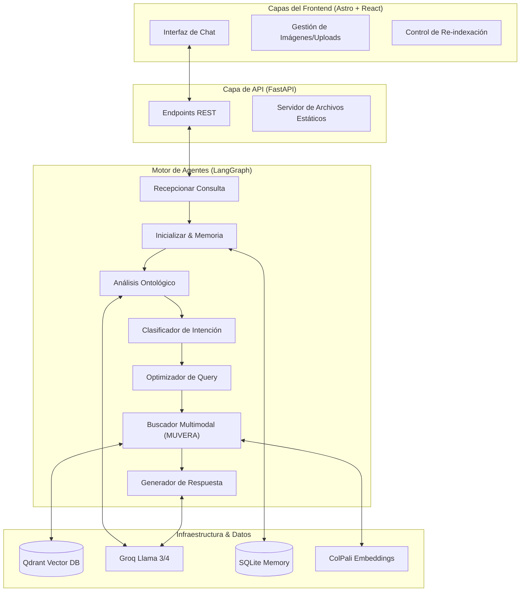

# 🔬 Histología RAG Multimodal

Este proyecto es un sistema de **RAG (Retrieval-Augmented Generation) Multimodal** especializado en histopatología. Combina procesamiento de lenguaje natural avanzado con visión artificial para permitir consultas complejas sobre tejidos, órganos y muestras histológicas, utilizando una arquitectura de agentes inteligentes y una base de conocimientos derivada de documentos científicos (PDFs).

## 🚀 Arquitectura del Sistema

El sistema se divide en tres capas principales que trabajan en conjunto para proporcionar respuestas precisas y visualmente verificadas.



---

## 🧠 Funcionamiento de los Agentes

El flujo de trabajo está orquestado por **LangGraph**, lo que permite una ejecución cíclica y condicional de tareas:

1.  **Recepción y Pre-procesamiento**: Captura el texto del usuario y maneja imágenes adjuntas (Base64), guardándolas temporalmente para su análisis visual.
2.  **Contexto Semántico**: Recupera la memoria de la conversación actual desde **SQLite** y extrae términos técnicos utilizando una **Ontología Histológica** personalizada.
3.  **Clasificación de Intención**: Determina si el usuario busca información teórica o si requiere explícitamente ver imágenes (micrografías).
4.  **Optimización de Consulta**: Un LLM reformula la pregunta original en términos técnicos optimizados para la búsqueda en la base de datos vectorial.
5.  **Búsqueda Multimodal (MUVERA)**: Ejecuta una de las tres estrategias de búsqueda según la necesidad (ver sección de Estrategias).
6.  **Generación de Respuesta**: Sintetiza la información recuperada (texto + imágenes) para producir una respuesta coherente y científicamente válida.

---

## 🔍 Estrategias de Búsqueda (The 3 Paths)

El sistema implementa tres caminos críticos para la recuperación de información:

### 1. Búsqueda de Texto Puro
Utilizada para preguntas teóricas. Busca en los chunks de texto indexados en **Qdrant** y devuelve contexto textual para el LLM.

### 2. Texto a Imagen (Label-based Semantic Matching)
Cuando el usuario pide ver un tejido (ej: *"mostrame un corte de arteria"*):
- Identifica el documento más relevante.
- Realiza un *scroll* de todos los chunks de texto buscando etiquetas de figuras (ej: *"Imagen 15: Túnica íntima"*).
- Mapea semánticamente la descripción de la etiqueta con la consulta del usuario.
- Recupera y muestra la imagen asociada a esa etiqueta en la misma página del PDF.

### 3. Imagen a Imagen (ColPali + Verificación 3-Tier)
Cuando el usuario sube una imagen para buscar similares o identificarla:
- **ColPali Embeddings**: Genera embeddings multimodales (late interaction) de la imagen subida.
- **MUVERA Search**: Búsqueda en dos etapas (FDE + MV) en Qdrant.
- **Verificación de Seguridad**:
    - **Tier 1 (Rechazo)**: Si el score ColPali es < 830, se rechaza por falta de coincidencia semántica.
    - **Tier 2 (DHash)**: Si el score está entre 830 y 900, se realiza una verificación visual estricta usando **Difference Hashing (dHash)** para descartar falsos positivos por color o textura.
    - **Tier 3 (Aceptación)**: Si el score es >= 900, se acepta como match de alta confianza.

---

## 🛠️ Stack Tecnológico

### Backend
- **FastAPI**: Servidor de alta performance.
- **LangGraph**: Orquestación de agentes cíclicos.
- **Qdrant**: Base de datos vectorial para embeddings multimodales.
- **ColPali**: Modelo de embeddings de última generación para documentos multimodales.
- **Groq (Llama 3/4)**: Inferencia de lenguaje de ultra-baja latencia.

### Frontend
- **Astro**: Framework para una carga ultra rápida y arquitectura de islas.
- **React**: Componentes dinámicos para el chat y la galería.
- **Tailwind CSS**: Diseño moderno con temática histológica (verdes médicos) y efectos de glassmorphism.

---

## 📦 Instalación y Configuración

1.  **Clonar el repositorio**:
    ```bash
    git clone <repo_url>
    cd mueva_test
    ```

2.  **Configurar el entorno**:
    Crea un archivo `.env` basado en `.env.example` con tus credenciales de Groq y Qdrant.

3.  **Instalar dependencias**:
    ```bash
    # Backend
    uv pip install -r pyproject.toml
    
    # Frontend
    cd frontend && npm install
    ```

4.  **Ejecutar el sistema**:
    ```bash
    # Terminal 1: Backend
    python api.py
    
    # Terminal 2: Frontend
    cd frontend && npm run dev
    ```

---

## 📂 Estructura de Datos
- `pdfs/`: Directorio donde se deben colocar los documentos para indexar.
- `histopatologia_data/`: Almacena los recortes de imágenes y metadatos extraídos de los PDFs.
- `uploads/`: Almacén temporal para imágenes subidas por el usuario.
- `chat_memory.sqlite`: Base de datos local para la persistencia de la memoria del asistente.
